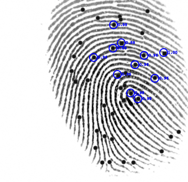

# 
A high-performance one-to-many (1:N) fingerprint matching library for commodity hardware, written in modern platform-independent C++.

[](./LICENSE)

Note: this library is focused on the matching problem. It does not currently extract minutiae from images.

The goal is to accurately identify one minutiae-set from 250K candidate sets within one second using modest laptop equipment. A secondary goal is to identify one minutiae-set from 1M candidate sets within one second, at a lower level of accuracy.

**Update 2020-11-12: goals have been exceeded @ 900K fp/s and 1.5M fp/s respectively (Linux x86_64 + clang 10). More optimizations, cache friendly tweaks, full vectorization and test tools to come.**

## Progress

  | TASK | COMPLETE | NOTES |
  | ---- | -------- | ----- |
  | Template loading | 100% | |
  | Local matching | 100% | |
  | Global matching | 100% | |
  | CMake support | 90% | flto not yet working on MSVC + clang |
  | Test suite | 30% | EER, FMR100, FMR1000, ZeroFMR |
  | Benchmarks | 25% | |
  | Parallelization | 100% | |
  | Optimization | 50% | Cache friendly, false sharing, better triplet elimination |
  | Vectorizaton (SIMD) | 0% | AVX2, NEON |
  | Minutiae/pair rendering | 100% | SVG output |
  | Certification/evaluation | | FVC-onGoing, MINEX III (requires minutiae extraction feature) |

## Supported operating systems

- Windows
- Linux
- Android
- iOS
- MacOS X
- And anywhere else you can find a C++17 toolchain

There is also a wrapper and qmake project file for incorporating with Qt projects.

## Roadmap

- Minutiae extraction feature
- Research quaternion descriptors
- CUDA implementation
- Additional template readers (ANSI INCITS 378-2004/2009 and proprietary formats)
- Benchmark other libraries

## Getting started

#### Install dependencies

```sh
sudo apt install clang cmake llvm libpthread-stubs0-dev
```

#### Build & run

```sh
git clone https://github.com/neilharan/openafis.git
cd openafis
cmake . && make
cli/openafis-cli one-many --f1 fvc2002/DB1_B/101_2.iso --load-factor 4000 --path data/valid
```

This example loads the entire FVC2002 and FVC2004 datasets into memory 4000 times, randomly shuffles them in memory (to minimize any unfair advantages from caching/prefetching) then searches for the best match for the template fvc2002/DB1_B/101_2.iso.

As both probe and candidate templates exist in the same dataset you can expect a 100% match and a reference to the same disk file. If you now rename the template indicated by --f1 and execute the test a second time you can expect a 78% match to a different impression from the same individual.

## Algorithm

Improving Fingerprint Verification Using Minutiae Triplets (https://doi.org/10.3390/s120303418).

## Dependencies

- Delaunay 2D Triangulation (https://github.com/delfrrr/delaunator-cpp) [MIT License]

## Supported minutiae template formats

- ISO/IEC 19794-2:2005 (https://www.iso.org/standard/38746.html)
- CSV. For research and interchange purposes

## Test datasets

Tests and benchmarks are performed on freely available datasets from the Fingerprint Verification Competition hosted by the University of Bologna.

These data include several hundred reference fingerprints of varying quality:

- FVC2002 (http://bias.csr.unibo.it/fvc2002)
- FVC2004 (http://bias.csr.unibo.it/fvc2004)

The FVC archives are supplied in the tif raster format. A small python program [EXTRACT][] is provided to extract minutiae in ISO 19794-2:2005 format template files using SecuGens free SDK (https://secugen.com/products/sdk). Many fingerprint readers/SDKs can produce ISO format templates natively.

## Results

#### Minutiae and matched pair rendering

[]()
[]()

FVC2002 DB1_B 101_1 and 101_7 respectively. The implementation can reliably match displaced and rotated minutiae.

These images were produced using the libraries Render class. The class creates two SVG's identifying (a) all minutiae (grey circles and squares), (b) paired minutiae (circled blue), and (c) similarity scores of pairs. The SVG's were then overlayed on top of the original FVC images.

#### Efficacy

Preliminary M:M [RESULTS] matching FVC 2002/2004 data. Every impression is matched against every other impression.

TODO

## Example

```C++
TemplateISO19794_2_2005 t1(101);
assert(t1.load("./fvc2002/DB1_B/101_1.iso"));
std::cout << "template " << t1.id() << ": size " << t1.size() << " bytes, #fingerprints " << t1.lmts().size() << std::endl;

TemplateISO19794_2_2005 t2(102);
assert(t2.load("./fvc2002/DB1_B/101_2.iso"));
std::cout << "template " << t2.id() << ": size " << t2.size() << " bytes, #fingerprints " << t2.lmts().size()) << std::endl;

static Match<unsigned int> match;
std::cout << "similarity = " << match.compute(s, t1, t2);
```

## Benchmarking

TODO

#### x86-64

  | METRIC | THREADS | OPTIMIZATION | PRODUCTION/RESEARCH | RESULT |
  | ------ | ------- | ------------ | ------------------- | ------ |
  | Load time¹ | | CPU | Production |
  | Memory usage | | CPU | Production | |
  | Memory usage | | Memory | Production | |
  | Memory usage | | CPU | Research | |
  | 1:N match time | 1 | CPU | Production | |
  | 1:N match time | 4 | CPU | Production | |
  | 1:N match time | | Memory | Production | |

#### aarch64

  | METRIC | THREADS | OPTIMIZATION | PRODUCTION/RESEARCH | RESULT |
  | ------ | ------- | ------------ | ------------------- | ------ |
  | Load time¹ | | CPU | Production |
  | Memory usage | | CPU | Production | |
  | Memory usage | | Memory | Production | |
  | Memory usage | | CPU | Research | |
  | 1:N match time | 1 | CPU | Production | |
  | 1:N match time | 4 | CPU | Production | |
  | 1:N match time | | Memory | Production | |

¹ 19794-2:2005 templates pre-loaded in memory. The time taken to produce indexed in-memory structures is recorded (we're not measuring disk I/O here).

## Licensing

OpenAFIS is licensed under the BSD 2-Clause License. See [LICENSE][] for the full license text.

[LICENSE]: https://github.com/neilharan/openafis/blob/master/LICENSE
[EXTRACT]: https://github.com/neilharan/openafis/blob/master/data/extract.py
[RESULTS]: https://github.com/neilharan/openafis/blob/master/results/fvs2002_2004_many_many.csv
